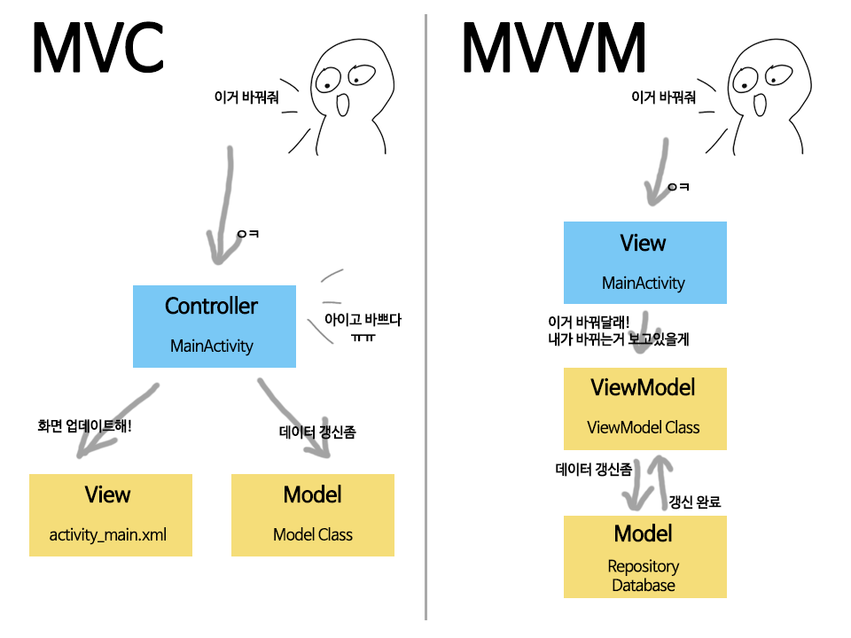

# MVVM 패턴이란 무엇일까? 🤔

이 문서 는 [To-Do App & Clean Architecture -Android Development - Kotlin](https://www.udemy.com/course/to-do-app-clean-architecture-android-development-kotlin/#instructor-1) 강의를 참고하여 만들었습니다.

## MVVM 패턴이란 무엇인가? 😀

 MVVM 이란 **View, ViewModel, Model** 이 결합된 형태로, 각각의 역할을 분리하여, 
 **가독성**과 **재사용성**을 높인 디자인 패턴이다.
 
 기존의 패턴들은 어떠한 문제점이 있었길래 이러한 패턴이 등장이 했을까?

> MVC와 MVVM의 차이점..
> 
> 
> 
MVC 패턴 같은 경우에는 **Controller**에 너무 집중되어 **코드가 무거워 진다**는 단점이 있다.

이러한 단점은 **유지보수** 하기 힘들고, **코드를 보기 어렵다.**


## MVVM 패턴을 왜 공부해야 할까? 🙄

필자의 경험으로 **View** 안에 모든 소스코드를 넣었다.

그러다 보니 View에 코드가 집중되고, 다른사람이 보기 코드보기가 너무 어려웠다.

 이러다 보니 디자이 패턴 의 필요성을 알게 되었고, 현재 **Android 공식문서**에 있는 **MVVM** 패턴의 필요성을 깨달았다.

---

## AAC MVVM 패턴의 구성요소와, 기능들 😄

 ### View

-   안드로이드의 **UI** 를 담당하는 프래그먼트, 액티비티를 의미한다.
-   **화면에 그릴 것**을 **결정**하고, **사용자**와 **상호작용** 한다.
-   **데이터 변화**를 감지하는 **옵저버**를 가지고 있다.

 ### ViewModel

-   **UI**를 그리는 데이터를 가지고 있으며, 변경되어도 괜찮다.

> 예제 소스

```KOTLIN
@InternalCoroutinesApi
class ToDoViewModel(application: Application) : AndroidViewModel(application) {

    private val toDoDao = ToDoDatabase.getDatabase(
        application
    ).toDoDao()
    private val repository: ToDoRepository = ToDoRepository(toDoDao)
    val getAllData: LiveData<List<ToDoData>> = repository.getAllData


    fun insertData(toDoData: ToDoData) {
        viewModelScope.launch(Dispatchers.IO) {
            repository.insertData(toDoData)
        }
    }

    fun updateData(toDoData: ToDoData) {
        viewModelScope.launch(Dispatchers.IO) {
            repository.updateData(toDoData)
        }
    }

    fun deleteItem(toDoData: ToDoData) {
        viewModelScope.launch(Dispatchers.IO) {
            repository.deleteItem(toDoData)
        }
    }

    fun deleteAll() {
        viewModelScope.launch(Dispatchers.IO) {
            repository.deleteAll()
        }
    }

}
```
> 이코드는 MVVM 패턴중 ViewModel 으로, **데이터의 변경사항**
> 을 담고 있다.

### LiveData

-   **Observer** 형식으로, 데이터 변경이 일어나면 감지가 가능하다.
-   최신 데이터로 변경할 수 있다.

### Repository

-   뷰모델과 상호작용하기 위해 **잘 정리된(Clean) 데이터 API**를 들고 있는 클래스이다. 
-   앱에 필요한 데이터, 즉 **내장 데이터베이스**나 **외부 웹 서버** 등에서 데이터를 가져온다.
-    따라서 뷰모델은 **DB나 서버**에 **직접 접근**하지 않고, **리포지토리**에 접근하는 것으로 **앱의 데이터**를 관리한다.

### Room

-   **Room** 은 SQLlite 의 상위 버전으로, 더 직관이고 편리하게 DB를 사용할 수 있다.


---
## MVVM 패턴의 장점은 무엇일까? 😀

-    View가 **data를 실시간**으로 관찰이 가능해, **데이터 불일치** 확률을 줄여준다. (LiveData)
-    뷰모델을 통해 데이터를 참조하기 때문에 **액티비티/프래그먼트**의 **생명주기**를 따르지 않는다.
-    화면전환과 같이 액티비티가 파괴된 후 재구성 되어도 **뷰모델이 데이터**를 **홀드**하고 있기 때문에 **영향**을 받지 않는다.
-    뷰가 활성화되어있을 경우에만 작동하기 때문에 **불필요한 메모리 사용**을 줄일 수 있다.
-    기능별로 모듈화 되어있어, **역할 분리**할수 있고 **테스트** 하기 쉽다.

## MVVM 패턴의 단점은 무엇일까? 😖

-   MVVM 패턴의 단점은 **class를 많이 만들**어야하고, 복잡하다.
-    이 과정이 복잡해지면 **생산성이 높아**진다.


## 마무리

MVVM 패턴 뿐만아니라  여러 디자인 패턴을 추가로 배워 상황에 따라 유동적으로 쓸수 있도록 공부해야 한다.