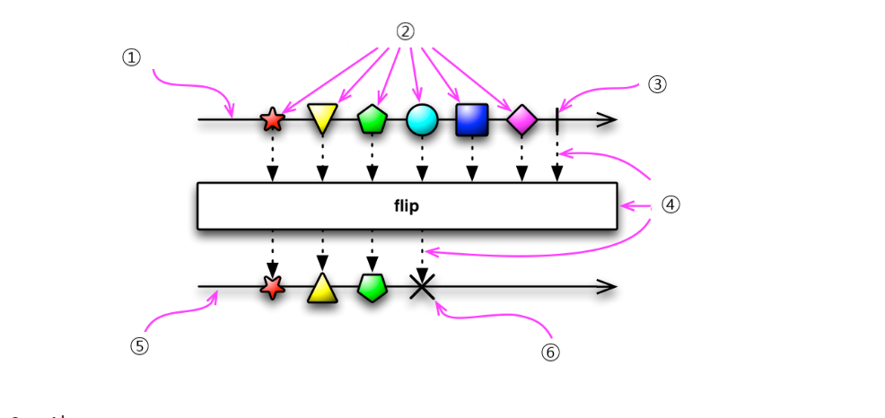
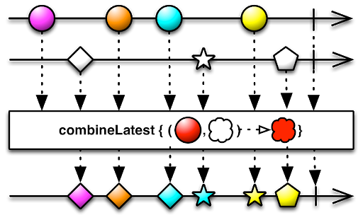

## 마블 다이어그램 어떻게 보는가?

### flip()의 마블 다이어그램 [ReactiveX 홈페이지](http://reactivex.io)

> #### 1. Observable의 시간 표시줄이다. 시간순서대로 데이터가 발행하는것을 표현
> #### 2. Observable에서 발행하는 데이터, 별, 삼각형, 오각형 원 드의 도형을 발행한다, 데이터가 발행할 때는 onNext 알림이 발생한다.
> #### 3. 파이프(I)는 Observable에서 데이터 발행을 완료했다는 의미이다. 한번 완료하면 데이터를 발행할 수 없다, 완료하면 onComplete 알림이 발생한다.
>#### 4.아래로 내려오는 점선 화살표는 함수의 입력과 출력의 데이터이다. 가운데 박스는 함수를 의미한다.
>#### 5. 함수의 결과과 출력된 시간 표시줄이다.
>#### 6. 엑스(X)는 함수가 입력값을 처리할 때 발생한 에러를 의미한다. 에러가 발생하면 onError 알림이 발생한다.

> #### 1. 첫번째 Observable은 같은 모양이지만 번호가 다른 도형을 발행한다.
> #### 2. 두번째 Observable은 모양이 다르지만 번호가 없는 도형을 발행한다.
> #### 3. combineLatest() 함수는 첫 번째 Observable의 도형과 두 번째 Observable의 도형이 모두 들어오면 둘을 합성한다. 
> #### 4. 가장 아래 표시줄은 combineLatest() 함수의 실행 결과로, 두 Observable의 결과를 조합한 것이다. 첫 번째 Observable에서 색상을 취하고 두 번째 Observable에서는 도형의 모양을 취했다.

