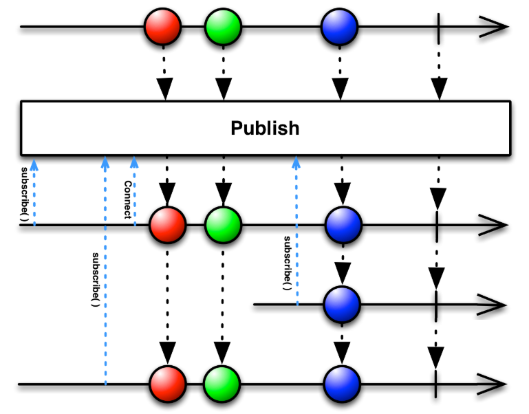

## ConnectableObservable 클래스

- ConnectableObservable 클래스는 subject 클래스 처럼 차가운 Observable을 뜨거운 Observable로 변환한다. 

- Observable을 여러 구독자들에게 공유할 수 있으므로 원 데이터 하나를 여러 구독자에 동시에 전달할 때 사용한다.

- subscribe() 함수를 호출해도 아무 동작이 일어나지 않는다 . 
> 왜냐하면 새로 추가된 connect() 함수를 호출해야 subscribe() 함수가 호출된다.

ConnectableObservable 객체를 생성하려면 먼저 Observable에 publish() 함수를 호출해야 한다.

이 함수는 여러 구독자에게 데이터를 발행하기 위해 connect() 함수를 호출하기 전 까지 데이터 발행을 유예(미루는)하는 역할을 한다.

> ConnectableObservablePublish() 함수의 마블 다이어그램
 