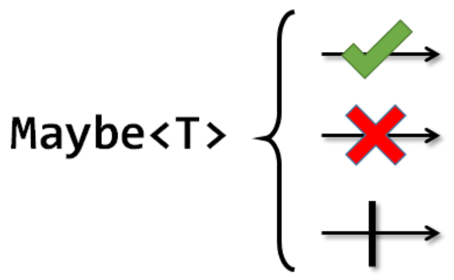

## Maybe 클래스

maybe class는 Rxjava에 처음으로 도입된 Observable의 또 다른 특수형태이다.

Single class 처럼 오직 데이터를 하나밖에 말행을 못하지만, 데이터 발행 없이 데이터를 완료할수 있다.

Single class 에서 onComplete 이벤트가 추가된 형태이다.

>single 클래스는 1개 완료 Maybe class는 0개 또는 1개 완료

> maybe 클래스의 마블 다이어그램

Maybe 객체는 Maybe 클래스로 로 할 수 있지만 observable의 특수한 연산자 를 통해 생성 될때가 많다.

Maybe로 가능한 연산자는
- elementAt()
- firstElement()
- flatMapMaybe()
- lastElement()
- reduce()
- singleElement()