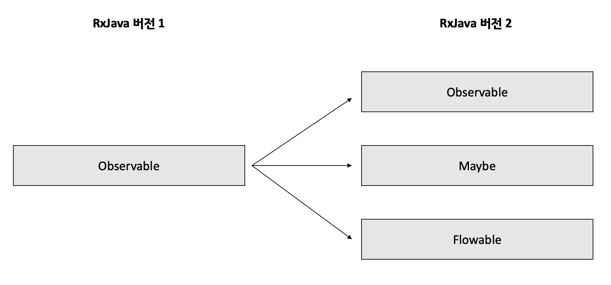
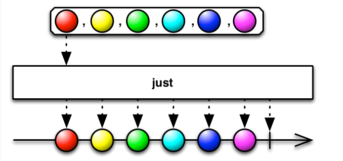

## Observable


## Observable,Observable을 만드는 함수에 대해 알아보자.

  - [Observable 이란?](#observable-란)
  - [just 함수](#just함수)
  - [subscribe()함수와 Disposable 객체](#subscribe-함수와-disposable-객체)
  - [create 함수](#create-함수)
  - [fromArray() 함수](#fromarray-함수)
  - [fromIterable() 함수](#fromlterable)
  - [fromCallable() 함수](#fromcallable-함수)
  - [fromFuture() 함수](#fromfuture-함수)
  - [fromPublisher() 함수](#frompublisher-함수)



 > RxJava 1.x에서는 Observable 만 있었지만 RxJava 2.x에서는 세분화 되었다.

  - Observable

  - Maybe

  - Flowable 
- Observable (관찰자) 아직 관찰되진 않았지만, 이론을 통하여 관찰할 가능성을 의미한다.
  
> 라이프 사이클은 존재하지 않는다.

### RxJava의 Observable은 세 가지의 알림을 구독자에게 전달한다.
 - **onNext :** Observable의 데이터 발행을 알린다.
 - **onComplete :** 모든 데이터의 발행을 완료했음을 알림, 단 한번만 발생하며 발생한 후에는 onNext 이벤트가 못발생함.
- **onError :** Observable에 어떠한 이유로 에러가 났다는걸 알린다. onError 이벤트가 밸생하면 onNext와 onComplete 이벤트가 발생하지 않는다. 즉 Observable의 실행이 중단된다.
 

## Observable Class의 함수들

### Observable 란

- Observable은 옵서버 패턴을 구현한다.
-  옵서버 패턴은 객체의 상태를 관찰자(옵서버) 목록을 객체에 등록한다. 그리고 무언가 변경사항이 있을 때 호출하여 옵서버에 알려준다.
-   라이프사이클은 존재하지 않은다.
> Observable의 뜻? 
>> 직관적으로 설명하자면 관찰자가 관찰하는 대상으로 말할 수 있다.

>> Observed라는 단어가 관찰을 통해서 얻는 결과를 뜻한다면 Observale은 현재는 관찰하진 않았지만 관찰할 가능성이 있음을 의미한ㄷ.


### just함수

데이터를 발행하는 가장 쉬운 방법은 기존의 자료구조를 사용하는 것이다.

just() 함수는 인자로 넣은 데이터를 차례대로 발행하려고 Observable을 생성한다. 
> 실제 발행은 subscribe() 함수를 실행해야한다.
>> 한 개의 값을 넣을 수 있고 **최대 10개의 값**을 넣을 수 있다. *단 타입은 모두 같아야한다.*<br>

</br>
중앙으 원은 Observable에서 발핸하는 데이터로 just() 함수를 거치면 입력한 원을 그대로 발행한다. 파이프(|) 표시는 모든 데이터 발행이 완료되었다는 의미이다.(onComplete 이벤트)

>인자가 N개인 just() 함수의 다이어그램



just() 함수로 1~6 까지의 원을 1개씩 발행한다. 모두 발행한 이후에는 완료(|) 한다.


*코드*
~~~kotlin

class FirstExampleKotlinJust {
    fun emit(){
        Observable.just(1,2,3,4,5,6).subscribe(System.out::print)
    }
}

fun main(){
    val demo=FirstExampleKotlinJust()
    demo.emit()
    
}
~~~
*결과*
~~~kotlin
1
2
3
4
5
6   
~~~

### subscribe() 함수와 Disposable 객체

Observable은 just() 등의 팩토리 함수로 데이터 흐름을 정의한 후 subsrcibe() 함수를 호출해야 실제로 데이터를 발행한다.

Rxjava는 동작시키길 원하는걸 미리 선언한다음 그것이 실행되는 시점을 조절할 수 있다.
 
>Rxjava는 선언형 프로그래밍이다.
>>먼저 선언하고 필요할 때마다 가져다 쓸 수 있다. 
>>실행할 동작을 구체적으로 명시하는 명령어 프로그래밍과 달리 선언형 프로그래밍은 단순히 목표만 선언한다

- Disposable 인터페이스의 함수
  
dispose()는 Observable에게 더 이상 데이터를 발행하지 않도록 구독을 해지하는 함수.

Observable 계약에 따르면 Observable이 onComplete 알림을 보냈을 때 자동으로 dispose()를 호출해 Observable과 구독자의 관계를 끊는다.

따라서 onCompose 이벤트가 끝나면 구독자가 별도로 dispose()를 호출할 필요가 없다.


>*코드*
```kotlin
   class ObservableNotificationsKotlin {

    fun emit() {
        val source = Observable.just("RED", "GREEN", "YELLOW")

        val d = source.subscribe(
            { v -> println("onNext() : value : $v") },
            { err -> println("onError() : err : ${err.message}") },
            { println("onComplete()") }

        )
        print("isDisposed() : "+d.isDisposed)
    }
}

fun main() {
    val demo = ObservableNotificationsKotlin()
    demo.emit()

```
>*출력*
``` kotlin
onNext() : value : RED
onNext() : value : GREEN
onNext() : value : YELLOW
onComplete()
isDisposed() : true
```

~~~
subscribe는 Observable을 찍기 위한 함수이고, Disposed는 subscribe에 있는 함수 인건가 ?? 아시면 답 부탁드립니다.
~~~

### create() 함수

just() 함수는 데이터를 넣으면 자동으로 알림 이벤트가 발생 되지만, create() 함수는
- onNext
- onComplete
- onError
   
 같은 알림을 개발자가 직접 호출해줘야 한다.
그래서 create() 함수는 개발자가 무언가를 직접 해야하는 느낌이 강하다.

just() vs create()
> just() 함수는 자동으로 데이터가 발행이 되지만, create() 함수는 개발자가 일일이 정해줘야한다.

<br>

> create() 함수 마블다이어그램


> 구독자 에게 알림을 발행하려면 onNext() 함수를 발행해야하며, 모두 발행한 후에는 onComplete 함수를 발행해야 한다.


[FirstExampleJava](#just함수) 예제와 다르게 Observable(Integer) 타입의 변수를 분리했는데 source 변수는 차가운 Observable입니다. 즉 첫 번째 문장으로는 실행이 안되고, 두 번째 subscribe() 함수를 호출 호출 했을 때 값이 찍힙니다. 만약 호출을 안하면 값이 안찍힙니다.

>*코드*
```kotlin
class ObservableCreateExampleKotlin {

    fun emit() {
        val source = Observable.create { emitter: ObservableEmitter<Int> ->
            emitter.onNext(100)
            emitter.onNext(200)
            emitter.onNext(300)

        }
        source.subscribe { data -> println("Result : $data") }
    }
}

fun main() {
    val demo=ObservableCreateExampleKotlin()
    demo.emit()
}
```

>*출력*
```kotlin
Result : 100
Result : 200
Result : 300
```

> 람다 형식으로 변경
```kotlin
public class subscribeLambda {
    private void emit() {
        Observable<Integer> source = Observable.create((ObservableEmitter<Integer> emitter) -> {

            emitter.onNext(100);
            emitter.onNext(200);
            emitter.onNext(300);
            emitter.onComplete();
        });
        source.subscribe(data->System.out.println("Result : " + data));
    }


    public static void main(String[] args) {

        subscribeLambda demo=new subscribeLambda();
        demo.emit();
    }
}
```
실행 결과는 위와 똑같다.
data는 변수 이름이므로 자신이 원하는 변수명을 적으면 된다.

* 리액티브 프로그래밍 에서는 람다와 래퍼런스를 적극적으로 사용하는 것이 좋다. 그리고 우선순위를 잘 고려해야한다.

> - 1. 메서드 레퍼런스로 축약할 수 있는지 확인
> - 2. 그다음 람다 표현식을 활용할 수 있는지 확인
> - 3. 1~2를 활용할 수 없으면 익명 객체나 멤버 변수로 표현


>익명 객체로 변환
```kotlin
public class subscribeAnonymously {
    private void emit() {
        Observable<Integer> source = Observable.create((ObservableEmitter<Integer> emitter) -> {

            emitter.onNext(100);
            emitter.onNext(200);
            emitter.onNext(300);
            emitter.onComplete();
        });

        source.subscribe(new Consumer<Integer>() {
            @Override
            public void accept(Integer data) throws Throwable {
                System.out.println("Result : " + data);
            }
        });
    }


    public static void main(String[] args) {

        subscribeAnonymously demo=new subscribeAnonymously();
        demo.emit();
    }
}
```
실행결과는 위와 똑같다.

익명 객체는 subsribe()의 원형을 알아야 하고 Consumer(T) 클래스의 메서드도 매번 입력을 해줘어야 하므로 번거롭다. 

#### Observable.create()를 사용할 때 주의할점

- 1. Observable 이 구독해지(dispose) 되었을때 callback 을 모두 해제해야 한다. 안 그러면 메모리 누수가 생긴다 
- 2. 구독자가 구독하는 동안에만 onNext와 onComplete 이벤트를 호출해야 한다.
- 3. 애러가 발생하면 onError 이벤트로만 에러를 전달해야 한다.
- 4. 배압을 직접 처리해야 한다.

### fromArray 함수

just() 함수나 create() 함수는 단일 데이터를 처리한다. 여러 데이터를 처리해야할 때는 fromXXX 계열 함수를 사용한다.

그중에 fromArray() 함수로 배열에 있는 데이터 값을 처리해보자
>*코드*
~~~kotlin 
class ObservableFromArrayKotlin {
    fun emit(){
    val arr= arrayOf(100,200,300);
        val source= Observable.fromArray(*arr);
        source.subscribe(System.out::println);
    }
}

fun main() {
    val demo=ObservableFromArrayKotlin()
    demo.emit()
}
~~~
>*결과*
~~~kotlin
100
200
300
~~~
데이터가 차례대로 발행이 된다.

### fromlterable

Observable을 만드는 방법들 중 하나는 Iterable 인터페이스를 구현한 클래스에서 Observable 객체를 생성하는 것이다. 반복자를 반환한다.

>Interagtor 인터페이스는 이터레이터 패턴을 구현한 것이므로, 
데이터의 값의 확인 여부와 얻어노는 것만 관여할 뿐 데이터타입에 의존하지 않는다.

Interable<E> 인터페이스를 구현하는 대표적인 클래스는
- ArrayList
- ArrayBlockingQueue
- LinkedList
- Stack
- TreeSet
- Vector
>>>등등이 있다..

>*ArrayList 코드*
~~~kotlin
class ObservableFromIterableKotlin {

    fun emit(){
        val names=ArrayList<String>()
        names.add("Jerry")
        names.add("William")
        names.add("Bob")

        val source= Observable.fromIterable(names)
        source.subscribe(System.out::println)
    }
}

fun main() {
    val demo=ObservableFromIterableKotlin()
 demo.emit()
}
~~~

*결과*
~~~kotlin
Jerry
William
Bob
~~~

>*Set 인터페이스 코드*

~~~kotlin
class ObservableFromIterableSetKotlin {

    fun emit(){
        val cities=HashSet<String>()
        cities.add("Seoul")
        cities.add("London")
        cities.add("Paris")

        val source= Observable.fromIterable(cities)
        source.subscribe(System.out::println)
    }
}

fun main(){
    val demo = ObservableFromIterableSetKotlin()
    demo.emit()
}
~~~
*결과*
    
```위와 같음```

> BlockingQueue
```kotlin 
class ObservableFromIterable {
    fun blockingQueueExample() {
        val orderQueue : BlockingQueue<Order> = ArrayBlockingQueue(100)
        orderQueue.add(Order("ORD-1"))
        orderQueue.add(Order("ORD-2"))
        orderQueue.add(Order("ORD-3"))

        val source = Observable.fromIterable(orderQueue)
        source.subscribe { order -> println(order.id)}
    }
}

fun main() {
    val demo = ObservableFromIterable()
    demo.blockingQueueExample()
}
```

>Order class
```Java
public class Order {

    private String mId;

    public Order(String id) {
        mId = id;
    }

    public String getId() {
        return mId;
    }

    @Override
    public String toString() {
        return "Order ID : "+mId;
    }
}
```

``` 결과
ORD-1
ORD-2
ORD-3
```

BlockingQueue 객체는 구현 클래스로 ArrayBlockingQueue를 사용했고, 최대 대기열수는 100개로 저장했다.  그리고 ORD-1 에서 3까지 입력했으므로 출력 결과는 Order 객체의 ID를 출력한다.

> #### 왜 map 객체에 관한 Observable 클래스의 from() 함수는 없을까?
>> Map 인터페이스는 배열도 아니고 Iteable< E > 인터페이스를 구현하지 않았으므로 from() 계열 함수는 존재하지 않는다.  

### fromCallable() 함수

기존 자바에서 제공하는 비동기 클래스나 인터페이스에 대해 살펴보자

자바 5에서 추가된 동시성 API인 Callable 인터페이스 이다.
비동기 실행 후 call() 메서드를 반환한다.


메서드가 하나고, 인자가 없다는 점에서 비슷하지만 실행 결과를 리턴하는 점에서 차이가 있다. 그리고 잠재적으로 다른 스레드에서 실행되는것을 의미하기도 한다.

>코드
```kotlin
class ObservableFromCallable {
    fun emit() {
        val callable = Callable {
            Thread.sleep(1000)
            "Hello Callable"

        }
        val source= Observable.fromCallable(callable)
        source.subscribe(System.out::println)
    }
}

fun main() {
    val demo=ObservableFromCallable()
    demo.emit()
}
```
> 결과
```kotlin
Hello Callable
```
### fromFuture() 함수 
Futcher 인터페이스는 동시성 API로 비동기 계산할 때 쓰인다.

Executors 클래스의  단일 스레드 실행자 newSingleThreadExecutor() 뿐만 아니라 다양한 스레드 풀을 지원한다. Rxjava에서는 스케쥴러를 권장한다.

> Future 객체에서 fromFuture() 함수를 사용해 Observable를 생성하는 방법
>> *코드*
```kotlin
class ObservableFromFuture {
    fun emit() {
        val future = Executors.newSingleThreadExecutor().submit<String> {
            Thread.sleep(1000)
            "Hello Future"
        }
        val source= Observable.fromFuture(future)
        source.subscribe(System.out::println)
    }
}

fun main() {
    val demo=ObservableFromFuture()
    demo.emit()
}
```
>*결과*

```kotlin
Hello Future
```

### fromPublisher() 함수 

Publlisher는 FlowApi 일부이다.

> fromPublisher() 함수를 이용한 *코드*
```KOTLIN
class ObservableFromIterableKotlin {

    fun emit(){
        val names=ArrayList<String>()
        names.add("Jerry")
        names.add("William")
        names.add("Bob")

        val source= Observable.fromIterable(names)
        source.subscribe(System.out::println)
    }
}

fun main() {
    val demo=ObservableFromIterableKotlin()
 demo.emit()
}

```
> *결과*
```kotlin
Hello Observable.fromPublisher()
```
Publisher 인터페이스는 Rxjava와 패키지 이름이다르다. Observable은
io.reactivex 패키지 인데 Publisher는 org.reactivestreams 이다.