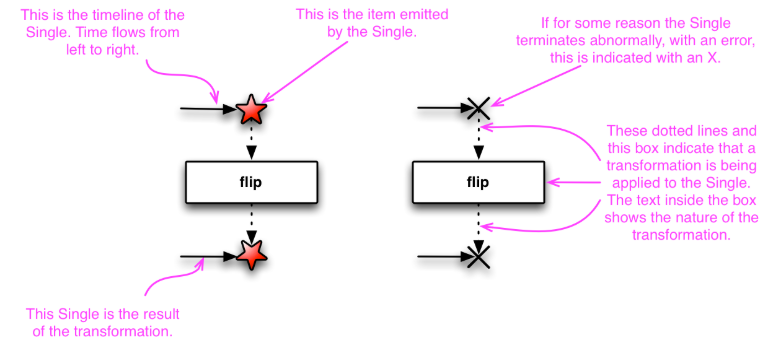

## Single

  - [just 함수](#just-함수)
  - [Observable에서 Single 클래스 사용](#observable에서-single-클래스-사용)

**Single** 클래스는 RxJava 1.x 부터 존재하는 observable의 특수한 형태이다.
Obbservable 클래스는 무한하게 데이터를 발행할 수 있지만, **Single**은 오직 데이터가 하나밖에 발행이 안됀다.

>보통 결과가 유한 서버 API 일때 유용하게 사용할 수 있다.

`이때 Singleton patton이 나온거라 추정된다.`

> Single 클래스의 마블 다이어그램
> 


중요한 점은 데이터가 발행한 동시에 종료 된다.(onSuccess) , 라이프 사이클 관점에서 보면 onNext와 onComplete 함수가 onSucess 함수로 통합된 것이다. **Single**의 라이프 사이클은 onSucess와 onError 로 구성된다.

### just 함수

Single클래스는 Observable 방식과 거의 같다.

> *코드*
```kotlin
class SingleExampleJustKotlin {

    fun emit(){
        val source= Single.just("Hello Single")
        source.subscribe(System.out::println)
    }
}

fun main() {
    val demo=SingleExampleJustKotlin()
    demo.emit()
}
```
> 결과
```kotlin 
Hello Single
```

### Observable에서 Single 클래스 사용

Single은 Observable의 특수한 형태이므로 Observable에서 변환할 수 있다.

>*코드*
```kotlin
class SingleExampleObservableKotlin {
    // 기존 Observable에서 Single 객체로 변환하기
    fun emit() {
        val source = Observable.just("Hello Single")
        Single.fromObservable(source)
            .subscribe { x -> println(x) }
    }

    // single() 함수를 호출해 Single 객체 생성하기
    fun single() {
        Observable.just("Hello Single")
            .single("default item")
            .subscribe { x -> println(x) }
    }

    // first() 함수를 호출해 Single 객체 생성하기
    fun first() {
        val colors = arrayOf("Red", "Blue", "Gold")
        Observable.fromArray(*colors).first("default value").subscribe { x -> println(x) }
    }
    // empty Observable에서 Single 객체 생성하기
    fun empty() {
        Observable.empty<String>().single("default value")
            .subscribe{x -> println(x) }
    }
    // take() 함수에서 Single 객체 생성하기
    fun take(){
        Observable.just(Order("ORD-1"),Order("ORD-2"))
            .take(1)
            .single(Order("default order"))
            .subscribe { x -> println(x)}
    }
}

fun main() {
    val demo=SingleExampleObservableKotlin()
    demo.emit()
    demo.single()
    demo.first()
    demo.empty()
    demo.take()
}
```
> 결과
```kotlin
Hello Single
Hello Single
Red
default value
Order ID : ORD-1
```

- 첫 번째
> Observable에서 첫 번째 값을 발행하면 onSuccess 이벤트 호출후 종료
- 두 번째
> single() 함수는 default value를 인자로 갖는다. Observable에서 값이 발행 안해도, 인자값을 대신 발행한다.
- 세 번째
> 여러개의 객체를 발행할 수 있다 first() 함수를 호출하면 Observable이 Single 객체로 반환된다. 하나 이상의 데이터가 발행하더라고 첫 번째 데이터 발행후 onSucess 이벤트가 발행된다.
- 네 번째 
> empty() 함수를 통해 Single 객체를 생성한다. observable에서 값이 발행 안해도 기본값을 ㄱ닺는 Singe 객체로 반환할 수 있다.
- 마지막
> String 타입 뿐만 아니라 Order와 같은 사용자 정의 클래스도 Singe에서 사용 할 수 있다.

### Single 클래스의 올바른 사용 방법

지금까지 Observable에서 Single 객체를 생성할 때 데이터가 하나만 발행하도록 했다 . 만약 여러개를 발행하도록 하면 어떻게 될까 ??
>*코드*
```kotlin
class SingleExampleErrorCaseKotlin {
    fun emit(){
        val source= Observable.just("Hello Single","Error").single("default item")
        source.subscribe{x->println(x)}
    }
}

fun main() {
    val demo=SingleExampleErrorCaseKotlin()
    demo.emit()
    
}
```
>출력
```kotlin
io.reactivex.rxjava3.exceptions.OnErrorNotImplementedException: The exception was not handled due to missing onError handler in the subscribe() method call. Further reading: https://github.com/ReactiveX/RxJava/wiki/Error-Handling | java.lang.IllegalArgumentException: Sequence contains more than one element!
	at io.reactivex.rxjava3.internal.functions.Functions$OnErrorMissingConsumer.accept(Functions.java:717)
	at io.reactivex.rxjava3.internal.functions.Functions$OnErrorMissingConsumer.accept(Functions.java:714)
	at io.reactivex.rxjava3.internal.observers.ConsumerSingleObserver.onError(ConsumerSingleObserver.java:46)
	at io.reactivex.rxjava3.internal.operators.observable.ObservableSingleSingle$SingleElementObserver.onNext(ObservableSingleSingle.java:81)
	at io.reactivex.rxjava3.internal.operators.observable.ObservableFromArray$FromArrayDisposable.run(ObservableFromArray.java:109)
	at io.reactivex.rxjava3.internal.operators.observable.ObservableFromArray.subscribeActual(ObservableFromArray.java:38)
	at io.reactivex.rxjava3.core.Observable.subscribe(Observable.java:13095)
	at io.reactivex.rxjava3.internal.operators.observable.ObservableSingleSingle.subscribeActual(ObservableSingleSingle.java:36)
	at io.reactivex.rxjava3.core.Single.subscribe(Single.java:4813)
	at io.reactivex.rxjava3.core.Single.subscribe(Single.java:4799)
	at io.reactivex.rxjava3.core.Single.subscribe(Single.java:4768)
	at Chap2.SingleExampleErrorCaseKotlin.emit(SingleExampleErrorCaseKotlin.kt:8)
	at Chap2.SingleExampleErrorCaseKotlinKt.main(SingleExampleErrorCaseKotlin.kt:14)
	at Chap2.SingleExampleErrorCaseKotlinKt.main(SingleExampleErrorCaseKotlin.kt)
Caused by: java.lang.IllegalArgumentException: Sequence contains more than one element!
```

에러 메세지는 두 번째 값을 발행하면서 onNext 이벤트가 발생할 때 에러가 발생했다고 알려준다.

> ### 함수인가 메서드인가.
>> 리액티브 프로그래밍은 함수형 프로그래밍 기법을 활용하므로 용어를 혼용해서 사용할 수 있다.

>> 이 책에서는 함수형 프로그래밍에 가까운 리액티브 연산자는 함수라고 표기한다.
>> 일반 자바 언어 기반은 메서드로 표기한다.

