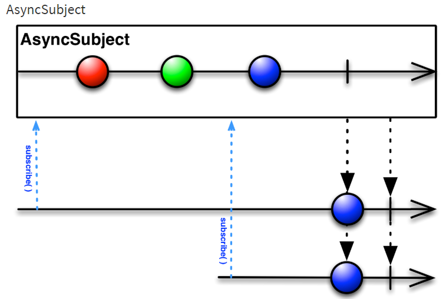

## Subject 클래스

Subject 클래스는 차가운 Observable을 뜨거운 Observable로 바꿔준다. 

Subject 클래스의 특성은 Observable의 속성과 구독자의 속성이 모두 있다.

Observable 처럼 데이터를 발행할 수 있고,  구독자처럼 발행된 데이터를 바로 처리할 수 있다.

RxJava에서 제공하는 주요 Subject 클래스에는

- AsyncSubject
- BehaviorSubject
- PublishSubject
- ReplaySbject 가 있다.

### AsyncSubject 클래스
AsyncSubject 클래스는 Observable에서 발행된 마지막 데이터를 얻어올 수 있다 그 이전 데이터는 무시한다.

> AsyncSubject 마블 다이어그램
> 


1. 처음 구독자가 subscribe()를 호출한다.
2. 이후에 '1' '2' 원이 발행된 후 두번째 구족자가 subscribe() 함수를 호출한다.
3. 마지막으로 '3' 이 발행하고 종료한다.

> 마블다이어그램으로 RxJava 이해하기

>>Rxjava를 이해하는 데 가장 중요한 것은 '시간' 이라고 생각한 후 이 책을 읽어보기

> *코드*
```kotlin
class AsyncSubjectExampleKotlin {

    fun emit(){
        val subject=AsyncSubject.create<String>()

        subject.subscribe { data -> println("Subscriber #1 => $data") }
        subject.onNext("1")
        subject.onNext("3")
        subject.subscribe { data -> println("Subscriber #2 => $data") }
        subject.onNext("5")
        subject.onComplete()
    }
}

fun main() {
    val demo = AsyncSubjectExampleKotlin()
    demo.emit()
}
```
> 결과
``` 
Subscriber #1 => 5
Subscriber #2 => 5
```

구독자로 동작하는 AsyncSubject 클래스
``` kotlin *코드*
class AsyncSubjectAsSubscribeKotlin {

    fun emit() {
        val temperature = arrayOf(10.1f, 13.4f, 12.5f);
        val source = Observable.fromArray(*temperature)

        val subject = AsyncSubject.create<Float>()
        subject.subscribe { data -> println("Subscriber #1 => $data") }

        source.subscribe(subject)
    }
}

fun main() {
    val demo=AsyncSubjectAsSubscribeKotlin()
    demo.emit()
}
```
> 결과
``` 
Subscriber #1 => 12.5
```

