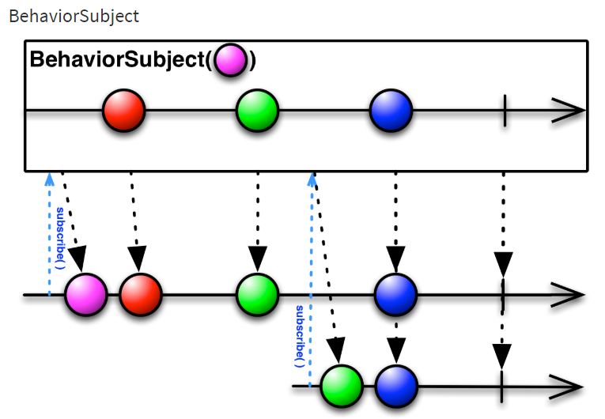
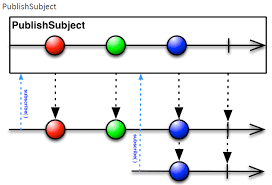
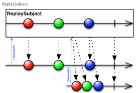

## Subject 클래스

Subject 클래스는 차가운 Observable을 뜨거운 Observable로 바꿔준다. 

Subject 클래스의 특성은 Observable의 속성과 구독자의 속성이 모두 있다.

Observable 처럼 데이터를 발행할 수 있고,  구독자처럼 발행된 데이터를 바로 처리할 수 있다.

RxJava에서 제공하는 주요 Subject 클래스에는

- [Subject 클래스](#subject-클래스)
  - [AsyncSubject 클래스](#asyncsubject-클래스)
  - [BehaviorSubject 클래스](#behaviorsubject-클래스)
  - [PublishSubject 클래스](#publishsubject-클래스)
  - [ReplaySubject 클래스](#replaysubject-클래스)
  - [데이터 발생자와 수신자](#데이터-발생자와-수신자)

> <-- 추가 내용 -->
> 
[데이터 발신자와 수진자](#데이터-발생자와-수신자)
### AsyncSubject 클래스
AsyncSubject 클래스는 Observable에서 발행된 마지막 데이터를 얻어올 수 있다 그 이전 데이터는 무시한다.

> AsyncSubject 마블 다이어그램
> 


1. 처음 구독자가 subscribe()를 호출한다.
2. 이후에 '1' '2' 원이 발행된 후 두번째 구족자가 subscribe() 함수를 호출한다.
3. 마지막으로 '3' 이 발행하고 종료한다.

> 마블다이어그램으로 RxJava 이해하기

>>Rxjava를 이해하는 데 가장 중요한 것은 '시간' 이라고 생각한 후 이 책을 읽어보기

> *코드*
```kotlin
class AsyncSubjectExampleKotlin {

    fun emit(){
        val subject=AsyncSubject.create<String>()

        subject.subscribe { data -> println("Subscriber #1 => $data") }
        subject.onNext("1")
        subject.onNext("3")
        subject.subscribe { data -> println("Subscriber #2 => $data") }
        subject.onNext("5")
        subject.onComplete()
    }
}

fun main() {
    val demo = AsyncSubjectExampleKotlin()
    demo.emit()
}
```
> 결과
``` 
Subscriber #1 => 5
Subscriber #2 => 5
```

구독자로 동작하는 AsyncSubject 클래스
``` kotlin *코드*
class AsyncSubjectAsSubscribeKotlin {

    fun emit() {
        val temperature = arrayOf(10.1f, 13.4f, 12.5f);
        val source = Observable.fromArray(*temperature)

        val subject = AsyncSubject.create<Float>()
        subject.subscribe { data -> println("Subscriber #1 => $data") }

        source.subscribe(subject)
    }
}

fun main() {
    val demo=AsyncSubjectAsSubscribeKotlin()
    demo.emit()
}
```
> 결과
``` 
Subscriber #1 => 12.5
```
onComplete() 함수를 호출한 후 구독
> *코드* 
```kotlin 
class AsyncSubjectonCompleteKotlin {
    fun emit() {
        val subject = AsyncSubject.create<Int>()
        subject.onNext(10)
        subject.onNext(11)
        subject.subscribe { data -> println("Subscriber #1 => $data") }
        subject.onNext(12)
        subject.onComplete()
        subject.onNext(13)
        subject.subscribe { data -> println("Subscriber #2 => $data") }
        subject.subscribe { data -> println("Subscriber #3 => $data") }

    }
}

fun main() {
    val demo = AsyncSubjectExampleKotlin()
    demo.emit()
}
```
> 결과
```kotlin
Subscriber #1 => 12
Subscriber #2 => 12
Subscriber #3 => 12
```

완료되기전 마지막 데이터만 가지고 있으므로 12가 찍히낟.

### BehaviorSubject 클래스

BehaviorSubject는 구독을 하면 가장 최근 값 혹은 기본 값을 넘겨주는 클래스이다.

> BehaviorSubject 클래스의 마블 다이어그램


여기서 '1'원은 BehaviorSubject 클래스를 생성할 때 넘긴 초기값이다.

첫 번째 구족자에 초기값을 받고 다음에 '2' 원부터 수신한다.  

두 번째 구독자는 '3' 원이 발행된 이후에 구독햇으므로 '3'원을 맨처음 발행한다.

> *코드*
``` kotlin
class BehaviorSubjectKotlin {
    fun emit(){
        val subject= BehaviorSubject.createDefault("6")
        subject.subscribe{data -> println("Subscriber #1 => $data")}
        subject.onNext("1")
        subject.onNext("3")
        subject.subscribe{data -> println("Subscriber #2 => $data")}
        subject.onNext("5")
        subject.onComplete()
    }
}

fun main() {
    val demo=BehaviorSubjectKotlin()
    demo.emit()
}
```
> 결과
 ``` kotlin
Subscriber #1 => 6
Subscriber #1 => 1
Subscriber #1 => 3
Subscriber #2 => 3
Subscriber #1 => 5
Subscriber #2 => 5
```

BehaviorSubject 는 다른 클래스와 다르게 createDefeault() 함수로 생성한다.

구독자가 subscribe() 함수를 호추했을 때 그전까지 값이 없다면 기본 값으로 발행 해줘야 하기 때문이다.

### PublishSubject 클래스

가장 평범한 Subject 클래스 이다. 

구족자가 Subscribe() 함수를 호출하면 값을 발행하기 시작한다. 

마지막 값을 발행하거나, 기본 값을 대신 발행 하지도 않는다. 오직 해당 시간에 발행한 데이터를 그대로 구독자에게 전달한다.

> PublishSubject 마블 다이어그램
> 


> *코드*

```kotlin
class PublishSubjectKotlin {
    fun emit() {
        val subject = PublishSubject.create<String>()
        subject.subscribe { data -> println("Subscriber #1 => $data ") }

        subject.onNext("1")
        subject.onNext("3")
        subject.subscribe { data -> println("Subscriber #2 => $data ") }
        subject.onNext("5")
        subject.onComplete()
    }
}

fun main() {
    val demo=PublishSubjectKotlin()
    demo.emit()
}
```
> 결과
``` kotlin
Subscriber #1 => 1 
Subscriber #1 => 3 
Subscriber #1 => 5 
Subscriber #2 => 5 
```

첫 번째 구독자는 Subject 클래스가 발행한 '1','3','5' 데이터를 모두 전달받으며, 두 번째 구독자는 구독한 이후에 발행된 데이터인 '5' 만 전달받는다.

### ReplaySubject 클래스

Subject 중에 가장 특이한 클래스이다. 

Subject 클래스의 목적은 뜨거운 Observable을 활요하는 것인데 차가운 Observable 처럼 동작하기 때문이다.

ReplaySubject 클래스는 구독자가 새로 생기면 항상 데이터의 처음부터 끝까지발행하는 것을 보장한다.

그러므로 데이터를 저장하는 과정 중메모리 누수가 발생할 가능성을 염두에 두고 사용해야 한다
>ReplaySubject 마블 다이어그램



> *코드*
```kotlin
class RelaySubjectKotlin {
    fun emit() {
        val subject = ReplaySubject.create<String>()
        subject.subscribe { data: String -> println("Subscriber #1 => $data") }
        subject.onNext("1")
        subject.onNext("3")
        subject.subscribe { data: String -> println("Subscriber #2 => $data") }
        subject.onNext("5")
        subject.onComplete()

    }
}


    fun main() {
        val demo = RelaySubjectKotlin()
        demo.emit()
    }

```
>결과
```kotlin
Subscriber #1 => 1
Subscriber #1 => 3
Subscriber #2 => 1
Subscriber #2 => 3
Subscriber #1 => 5
Subscriber #2 => 5

```

 ### 데이터 발생자와 수신자

|데이터 발행지(data source) |데이터 수신자|
|------|---|
|Observable|구독자(Subscriber)|
|Single|옵서버(Observer)|
|Maybe|소비자(Consumer|
|Subject|
|Completable|

1. **구독자** Rxjava에서 Observable과 연결할 때는 subscribe() 함수를 호출합니다. 이 과정이 구독이므로 구독자가 된다.
> subscribe 를 호출하는 행위가 구독 
> 
> 구독자는 호출당하는 대상?
>  A -> Observable를 호출 A가  구독한다. A는 구독자
2. **옵서버** : RxJava는 옵서버 패턴을 구현, 따라서 데이터 발신자는 Observable이 되고 데이터수신자를 옵서버라고 할 수 있다.
> A -> Observable 패턴
 
> A는 데이터 발신자, Observable 패턴은 데이터 발신자

3. **소비자** : RxJava 1.x에서는 subscribe() 함수를 호출할 때 Subscriber 클래스를 인자로 넘겼지만 ,
 
    RxJava 2에서는 모두 함수형 인터페이스인 Consumer를 인자로넘긴다. **이는 자바 8과 같은 이름을 사용하기 위해서다.**
>  Rxjava 1.x subscribe() -> Subscriber 클래스 but Rxjava 2 subscribe() -> Consumer
