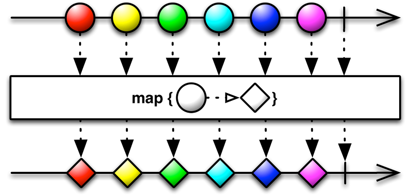

## map() 함수

map() 함수는 입력값을 어떤 함수에 넣어서 원하는 값으로 변환하는 함수

String -> String Or String -> Integer 등등

객체지향 프로그래밍과 다른 점은 '어떤 화면에 넣어서' 이다.

map() 함수는 입력 데이터와 그것을 변환해줄 함수를 이어주는 중개업자가 있다고 생각하면 편하다.

> map() 함수의 마블 다이어그램

원을 받아서 다이아로 변환한다.

